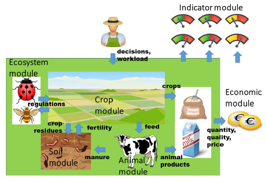

Situation
---------

.. zotero-setup::
   :style: ieee

.. default-role:: xcite

I am going to research the potential for a knowledge-sharing and
modeling framework, based on the African Highland Farmer Game (AHF).
This is a game, initially developed for policymakers, which simulates
the challenges a farmer in the highlands of Tanzania faces. It
incorporates soil conservation techniques, as well as socioeconomic
management strategies
`[@SchoolenbergCreatingAwarenessDecision2012]` [p. 10] It
was initially developed in Adobe Flash, and is therefore not playable
anymore as of 2021. There has been renewed interest in it by Farmz2U and
SIDI (France). Farmz2U is a Nigeria-based company that aims to foster
knowledge-sharing between farmers, increase access to capital and inputs
for farmers, and provide a virtual environment for starting farmers. The
virtual environment is based on the AHF, and aims to act as a sandbox
environment in which farmers can test out different farming pathways,
before actually implementing it in practice. SIDI wants to use the AHF
for training of workers to assess agroecological practices (personal
communications)

Since the game is currently under active development, it can be adapted
to local needs, which are versatile. Nigeria itself is a large country,
with drylands in the northeast bordering the Sahel, and a tropical wet
climate in the south. Food security in some regions is very low, at 64%
`[@BabatundeSocioEconomicsCharacteristicsFood2007]`,
or one-third `[@EforuokuDeterminantsNutrientAdequacy2020]` of households in Kwara state. In the northern drylands, farmers are food
secure, but lack micronutrients `[@EforuokuDeterminantsNutrientAdequacy2020]`. They
have been facing droughts and high temperatures and have developed
effective coping strategies, often based on indigenous knowledge.
However, with projected climate change, these are expected to become
inadequate, and more research is needed
`[@JellasonReviewFarmingChallenges2021]`. Due to
increased land use, traditional slash-and-burn methods incorporating
fallowing no longer have a sustainable fallowing period, resulting in
the need for alternatives such as alley cropping. Farmers that adopt
these strategies also modify them, such as introducing fallowing or
changing pruning practices from the methods taught by researchers. This
is a valuable knowledge source that is currently not used much
@AdesinaDeterminantsFarmersAdoption2002.
Furthermore, state interventions focus on access to capital and inputs
such as fertilizers
`[@MgbenkaReviewSmallHolder2015]`, which arguably
reduce the resilience of farmers, to climatic shocks, while also
increasing yields and therefore food security
`[@JellasonReviewFarmingChallenges2021; @MgbenkaReviewSmallHolder2015]`.
Simultaneously, organic farming practices are not often used in
South-South Nigeria
`[@AtomaAdoptionOrganicFarming2020]`. Farmer's
valuation of extension workers is very poor, because of poor extension
worker education and limited availability
`[@JellasonReviewFarmingChallenges2021; @MgbenkaReviewSmallHolder2015]`.
In this light, with increased usage of mobile (smart)phones in Nigeria,
digital extension has been developed in the form of an app that is
promising
`[@AdesemowoHarnessingPotentialsMobile2020]`. This
app provides best practices to farmers, and has been positively received
by farmers and government officials. Since it has also been recently
developed, it is under active development.

Current development together with Farmz2U focuses on farms on the Jos
plateau. The Jos plateau has an average annual precipitation of around
1260 mm and an average temperature of :math:`22\deg C`. The farm size is
an average of 2.36 ha and mostly mixed systems. Formerly, lower ‘areas
known as *Fadama*\  [1]_ were the only places where agriculture was
irrigated. However, with the advent of pump-irrigation systems, higher
areas have also become available for irrigation. The water can be
sourced from streams, rivers, or ponds from former open-cast tin mines
.. `[@ThapaFarmers2012; @YilaAdoption2008]`. This
raises some concerns regarding pollution of heavy metals
`[@GazuwaEvaluation2021]`. From rivers, only Pb is
above permissible levels by the WHO
`[@PasquiniChemical2004]`. However, for use of
organic solid waste, levels for multiple heavy metals, specifically As
and Se are above permissible levels
`[@UriahEnvironmental2014]`.

In terms of adopting sustainable land management practices, farmers opt
for measures with short-term benefits. The most important measures are
Crop rotation, inorganic fertilizers and farm-yard manure. Even though
farmers are aware of the long-term drawbacks of artificial fertilizers
such as easy leeching, short-term yield effects and hardening of the
soils, this often outweighs the benefits such as easy and effective
application. Crop rotation is mainly practiced because it stabilizes
income under varying weather conditions.

Other measures that are less popular are mulching, crop residue barriers
and legume cultivation. The main impediment to adaptation is that the
benefits are only experienced after multiple years, and farmers do not
have the capital to make up for that. Furthermore, agroforestry is
promoted as an erosion prevention measure and possible income source,
but this is also not widely adopted because trees reduce the arable land
size and also take multiple years to become profitable
`[@ThapaFarmers2012]`.

Problem
-------

However, the platform of
`[@AdesemowoHarnessingPotentialsMobile2020]`, as well as
the AHF currently lack the ability for farmers to contribute to
knowledge creation. Furthermore, the AHF has been developed for the
Tanzanian highlands, and as such may need to be re-calibrated to the
Nigerian context. moreover, due to the heterogeneity of the Nigerian
climate and context, it may need to dynamically re-adapt, based on
climate, soil and local farming practices. For the game to be able to
work well in such a broad context, it needs to be based on a sound
modeling framework, that is proven to be effective in different
climates, and across different types of farms. Furthermore, it should
both incorporate the biophysical aspects, as well as the socioeconomical
dimension of farming. There are other models that incorporate both
socioeconomical as biophysical aspects, such as FarmDESIGN. This has
also been proven to be accurate over multiple climatic zones and can be
used with limited data `[@Groot2012]`. However, this
requires quite advanced knowledge to operate. The source code is also
not freely available, so it is impossible to build a game on top of this
model. There are other games on agroecological farming, notably SEGAE.
SEGAE is a serious game developed to help farmers practice systems
thinking and select synergetic measures. It is based around modules for
animals, crops, soil and ecosystems, where the challenge is to make a
farm that is socially, environmentally and economically sustainable
An overview is shown in figure `1 <#fig:segae>`__. This is a promising
framework, but may be a bit too complex. The source code for the basic
module is also freely available, which may give a head start.

   The module-based architecture of SEGAE

On top of that, Novel GIS databases, as well as cloud services such as
the Google Earth Engine could further enhance the AHF. However, it is
currently unknown what farmers needs are in this respect, since the
development of such platforms has not been established.

Question
--------

Therefore, the question is what factors should be incorporated when
further developing the Highland Farmer Game, what stakeholders and
(government) institutions can be involved, and whether it should further
promote intensification, use of (organic) conservation techniques or
both. Such a framework for knowledge-sharing exists in the programming
or GIS context as StackOverflow/StackExchange, but not yet in a farming
context. Since responses to the preliminary framework developed by
`[@AdesemowoHarnessingPotentialsMobile2020]` have
been positive, there should be potential for its development.

Response
--------

The response will be a participatory development of the framework,
incorporating local farmer's experiences, as well as academics and
(possibly) government institutions. Digital communication has been
proven successful for advancing knowledge creation and science in other
contexts
`[@BeckOpenInnovationScience2020; @KrewinkelFormattingOpenScience2017; @WoelfleOpenScienceResearch2011]`.
But has still to be proven effective in the current farming context.
Therefore, I will make an attempt to replicate the methods proposed by
`[@WoelfleOpenScienceResearch2011]`, in this context.
This will include model and platform creation, and evaluation by
semi-structured interviews with users of the platform. Of course, the
exact form will depend on the development of the current pandemic and
situation in (northwestern) Nigeria.

.. [1]
   "Fadama is a Hausa word meaning seasonally waterlogged or flooded
   depression or flood plain. The word gained an international
   acceptance in agriculture." `[@ThapaFarmers2012 poep]`
